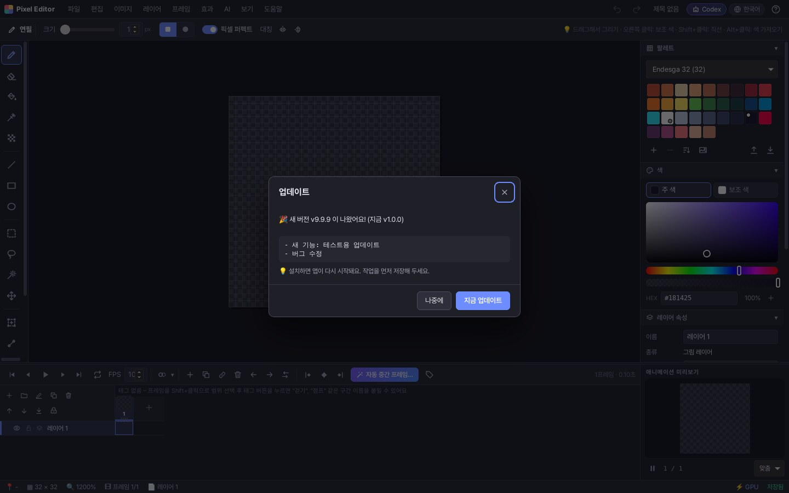

# 출시(배포) 안내서

이 문서는 "만든 프로그램을 사용자에게 전달하는 방법"을 순서대로 설명합니다.

---

## 0. 출시 전 점검 (매번)

```bash
npm ci                 # 깨끗하게 설치
npm run typecheck      # 타입 오류 0개
npm test               # 단위 테스트 전부 통과
npm run e2e            # 브라우저 점검 전부 통과 (처음 한 번: npx playwright install chromium)
npm run rust:test      # 데스크톱 Codex 연동 테스트 (Rust 설치 필요)
```
GitHub 에 올리면 `.github/workflows/ci.yml` 이 같은 점검을 자동으로 합니다.

버전 올리기: `package.json`, `src-tauri/tauri.conf.json`, `src-tauri/Cargo.toml` 의 `version` 을 같은 값으로 바꾸고 `CHANGELOG.md` 에 변경 내용을 적습니다.

---

## 1. 웹 버전 (PWA)

```bash
npm run build          # dist/ 폴더 생성
```
`dist/` 폴더를 정적 호스팅(Netlify, Vercel, Cloudflare Pages, GitHub Pages 등)에 올리면 끝입니다.
- **https 주소**여야 설치(PWA)·오프라인 실행·라이선스 확인이 동작합니다.
- 상대 경로(`base: './'`)로 빌드하므로 하위 폴더 주소에서도 동작합니다.
- 새 버전을 올리면 서비스 워커가 자동으로 새 파일을 받아 옵니다. (버전별 캐시)

웹 버전에서 AI 기능을 쓰려면 사용자가 자기 컴퓨터에서 `npm run codex-bridge` 를 실행해야 합니다.
배포 주소가 `http://localhost:5173` 이 아니라면 브리지에 허용 주소를 알려 줘야 합니다:
```bash
CODEX_BRIDGE_ORIGINS=https://my-pixel-editor.example.com npm run codex-bridge
```

---

## 2. 데스크톱 버전 (Tauri – Windows / macOS / Linux)

### 준비 (한 번만)
1. Rust 설치: https://rustup.rs
2. 운영체제별 준비물: https://tauri.app/start/prerequisites/
   - Windows: Microsoft C++ Build Tools, WebView2 (Windows 11 은 기본 설치)
   - macOS: Xcode Command Line Tools (`xcode-select --install`)
   - Linux(Ubuntu): `sudo apt install libwebkit2gtk-4.1-dev libappindicator3-dev librsvg2-dev patchelf`

### 실행 / 설치 파일 만들기
```bash
npm run desktop:dev     # 개발용 창 열기 (코드 수정이 바로 반영)
npm run desktop:build   # 설치 파일 생성 → src-tauri/target/release/bundle/
```
- Windows: `.msi`, `.exe`(NSIS) / macOS: `.dmg`, `.app` / Linux: `.deb`, `.rpm`, `.AppImage`
- 아이콘을 바꾸려면: 512×512 PNG 를 준비하고 `npx tauri icon 내아이콘.png`

### GitHub 에서 자동으로 만들기
`v1.0.0` 같은 태그를 올리면 `.github/workflows/release.yml` 이 세 운영체제 설치 파일을 만들어 **GitHub Release 초안**에 올립니다.
```bash
git tag v1.0.0 && git push origin v1.0.0
```

### 출시 작업이 켜 주는 기능 한눈에 보기

`release.yml` 은 저장소 **Settings → Secrets and variables → Actions** 에 값이 있을 때만 해당 기능을 켭니다.
값이 하나도 없어도 출시 작업은 성공하고, "서명 없는" 설치 파일이 만들어집니다.

| 기능 | Secrets (비밀값) | Variables (공개 값) |
| --- | --- | --- |
| 자동 업데이트 | `TAURI_SIGNING_PRIVATE_KEY`, `TAURI_SIGNING_PRIVATE_KEY_PASSWORD` | (선택) `TAURI_UPDATER_PUBKEY`, `TAURI_UPDATER_ENDPOINT` |
| Windows 서명 – PFX | `WINDOWS_CERTIFICATE`(base64), `WINDOWS_CERTIFICATE_PASSWORD` | – |
| Windows 서명 – Azure | `AZURE_CLIENT_ID`, `AZURE_CLIENT_SECRET`, `AZURE_TENANT_ID` | `AZURE_SIGNING_ENDPOINT`, `AZURE_SIGNING_ACCOUNT`, `AZURE_SIGNING_PROFILE` |
| macOS 서명·공증 | `APPLE_CERTIFICATE`, `APPLE_CERTIFICATE_PASSWORD`, `APPLE_SIGNING_IDENTITY`, `APPLE_ID`, `APPLE_PASSWORD`, `APPLE_TEAM_ID` | – |
| 오류 보고 | – | `ERROR_REPORT_URL` (https) |

설정이 어떻게 합쳐지는지는 `scripts/release/tauri-release-config.mjs` 에 있습니다. (비밀값은 결과 파일에 쓰지 않음)

### 자동 업데이트 켜기 (처음 한 번)

```bash
npm run updater:keygen          # 키 만들기 + tauri.conf.json 에 공개 키 넣기
```
1. 개인 키 `.secrets/updater.key` 를 **안전한 곳(비밀번호 관리자 등)에 백업**하세요. 잃어버리면 이미 설치한 사용자에게 업데이트를 보낼 수 없습니다.
   (`.secrets/` 는 `.gitignore` 에 들어 있어서 git 에 올라가지 않습니다)
2. GitHub Secrets 에 `TAURI_SIGNING_PRIVATE_KEY`(파일 내용 전체), `TAURI_SIGNING_PRIVATE_KEY_PASSWORD`(암호, 없으면 빈 값) 를 넣습니다.
3. 바뀐 `src-tauri/tauri.conf.json`(공개 키)을 커밋하고, 버전을 올린 뒤 태그를 올립니다. → 릴리스 초안에 설치 파일 + `.sig` + `latest.json` 이 올라갑니다.
4. 릴리스 초안을 **Publish** 하면, 사용자 앱이 하루 한 번 확인할 때(또는 도움말 > 업데이트 확인) 새 버전을 찾습니다.

알아 둘 점
- 업데이트 주소는 기본으로 `https://github.com/<저장소>/releases/latest/download/latest.json` 입니다. **비공개 저장소는 릴리스 파일을 받을 수 없으니**
  공개 저장소나 별도 서버(예: Cloudflare R2, S3)를 쓰고 `TAURI_UPDATER_ENDPOINT` 변수로 주소를 바꾸세요. (https 만 허용)
- 받은 파일은 앱 안의 공개 키로 **서명을 확인한 뒤에만** 설치됩니다. 변조된 파일은 거부됩니다.
- 공개 키가 비어 있는 빌드는 업데이트 기능이 꺼진 채로 동작합니다. (메뉴에서 "자동 업데이트가 꺼져 있어요" 안내)
- 실제로 확인해 보기 (개발자용):
  ```bash
  # 시험용 키로 서명한 가짜 업데이트를 내 컴퓨터 서버에 올려 두고
  UPDATER_TEST_PUBKEY="$(cat .secrets/updater.key.pub)" UPDATER_TEST_ENDPOINT=http://127.0.0.1:8787/latest.json \
    cargo test --manifest-path src-tauri/Cargo.toml -- --ignored
  ```



### 코드 서명 (판매용이라면 강력 추천)

서명하지 않으면 Windows "알 수 없는 게시자"(SmartScreen) 경고, macOS "확인되지 않은 개발자" 경고가 뜹니다.
**인증서는 판매자(개인/회사) 명의로 직접 구매·발급**해야 하며, 이 저장소에는 넣을 수 없습니다. 준비되면 비밀값만 등록하면 됩니다.

**macOS** (Apple Developer Program, 연 $99)
1. Developer ID Application 인증서를 만들고 `.p12` 로 내보냅니다.
2. `APPLE_CERTIFICATE`(= `base64 -i cert.p12`), `APPLE_CERTIFICATE_PASSWORD`, `APPLE_SIGNING_IDENTITY`(예: `Developer ID Application: 홍길동 (TEAMID)`),
   `APPLE_ID`, `APPLE_PASSWORD`(앱 전용 암호), `APPLE_TEAM_ID` 를 넣으면 서명 + 공증(notarize)까지 자동으로 됩니다.

**Windows** – 둘 중 하나
- **A. PFX 파일이 있는 인증서**: `WINDOWS_CERTIFICATE`(= PFX 파일을 base64 로), `WINDOWS_CERTIFICATE_PASSWORD`
  ```powershell
  [Convert]::ToBase64String([IO.File]::ReadAllBytes("cert.pfx")) | Set-Clipboard
  ```
- **B. Azure Trusted Signing (추천)**: 요즘 OV/EV 인증서는 USB 토큰에 들어 있어 파일로 내보낼 수 없는 경우가 많습니다.
  Azure 에서 Trusted Signing 계정 + 인증서 프로필을 만들고, 서명 권한이 있는 앱 등록(서비스 주체)을 만든 뒤
  Secrets `AZURE_CLIENT_ID`, `AZURE_CLIENT_SECRET`, `AZURE_TENANT_ID` 와 Variables `AZURE_SIGNING_ENDPOINT`(예: `https://wus2.codesigning.azure.net`),
  `AZURE_SIGNING_ACCOUNT`, `AZURE_SIGNING_PROFILE` 을 넣으세요. (https://tauri.app/distribute/sign/windows/)

**Linux**: 별도 서명 없이 배포하는 경우가 대부분입니다. (`.deb`/`.rpm`/`.AppImage`)

### 오류 보고 켜기 (선택)

사용자가 **직접 동의한 경우에만** 오류 내용이 전송됩니다. (설정 > 데이터 > 오류 자동 보내기, 또는 오류 화면의 "개발자에게 보내기")
보내는 것: 오류 메시지·위치(stack), 앱 버전, 운영체제·브라우저 종류, 언어, 쓰던 도구 / 보내지 않는 것: 그림, 프로젝트, 파일 이름, 이메일, 폴더 경로.

1. 받는 서버를 실행합니다. 예제: `npm run error-receiver` (기본 `http://127.0.0.1:8790/report`, 결과는 `error-reports.jsonl`)
   ```bash
   HOST=0.0.0.0 PORT=8790 ALLOWED_ORIGINS=https://my-editor.example.com REPORT_FILE=/data/reports.jsonl node scripts/error-receiver.mjs
   ```
   실제 운영에서는 https 주소(리버스 프록시) 뒤에 두세요. IP 주소는 저장하지 않습니다.
2. 빌드할 때 주소를 알려 줍니다.
   - 웹: `.env` 에 `VITE_ERROR_REPORT_URL=https://reports.example.com/report` (`.env.example` 참고)
   - 데스크톱: `PIXEL_EDITOR_ERROR_REPORT_URL=https://reports.example.com/report npm run desktop:build`
   - GitHub 릴리스: 저장소 Variables 에 `ERROR_REPORT_URL`
3. 주소가 없는 빌드에서는 오류 보고 기능이 보이지 않고, "오류 내용 복사"만 쓸 수 있습니다.

---

## 3. AI 기능 (Codex) 안내 – 사용자용

AI 기능은 **OpenAI API 키를 쓰지 않고**, 사용자의 **ChatGPT 계정으로 로그인한 Codex CLI** 를 실행합니다.
사용량은 사용자의 ChatGPT 요금제 한도에서 차감됩니다.

```bash
npm install -g @openai/codex     # 1) 설치 (Node.js 필요)
codex login                      # 2) 브라우저에서 ChatGPT 로그인
```
- 데스크톱 앱: 바로 사용 가능 (앱이 codex 를 직접 실행)
- 웹 버전: `npm run codex-bridge` 를 켜 둔 상태에서 사용
- 에디터의 **🤖 Codex** 버튼 → 연결 상태 확인 (설치 / 로그인 / 로그인 방식)
- `codex login status` 가 API 키 로그인이라고 나오면 `codex logout` 후 `codex login` 으로 다시 로그인하세요.

---

## 4. 라이선스 키 판매

키는 **판매자만 가진 개인 키**로 서명하고, 프로그램에는 **공개 키**만 들어갑니다. 인터넷 없이 확인됩니다.
(기능 제한은 없고 "정품 등록" 표시만 바뀝니다. 기능을 막고 싶다면 `src/licensing/license.ts` 의 `currentLicense()` 결과를 이용하세요.)

```bash
# 1) 처음 한 번: 키 쌍 만들기 (개인 키 파일은 절대 git 에 올리지 마세요!)
npm run license -- keygen ./license-private.json
#    → 화면에 나온 공개 키로 src/licensing/publicKey.ts 를 바꾸고 다시 빌드

# 2) 판매할 때마다: 키 발급
npm run license -- issue ./license-private.json "홍길동" hong@example.com pro "" ORDER-0001
#    plan: personal | pro | team,  만료일을 넣으려면 "" 대신 2027-12-31

# 3) 문의가 오면: 키 확인
npm run license -- verify ./license-private.json PXE1.xxxx.yyyy
```
⚠ 지금 `publicKey.ts` 에 들어 있는 값은 **개발용**입니다. 판매 전에 반드시 1)을 실행해 바꾸세요.

---

## 5. 개인정보 · 상표

- 프로그램은 작업 내용을 외부로 보내지 않습니다. 예외: 사용자가 AI 기능을 실행할 때 그 작업에 필요한 이미지/설명만 Codex(OpenAI)로 전송됩니다.
- 오류 보고는 기본으로 꺼져 있고, 사용자가 동의한 경우에만 개인 정보를 지운 오류 내용을 보냅니다. (위 "오류 보고 켜기")
- 데스크톱 앱은 하루 한 번 업데이트 주소(latest.json)에 접속해 새 버전을 확인합니다. (설정에서 끌 수 있음, 개인 정보 전송 없음)
- 자동 저장/최근 파일/설정은 사용자의 브라우저(IndexedDB/localStorage)에만 저장됩니다.
- 프로그램 이름 "Pixel Editor" 는 임시 이름입니다. 판매 전 상표 검색 후 고유한 이름으로 바꾸는 것을 추천합니다.
- 포함된 오픈소스 라이브러리(React, Zustand, gifenc, gifuct-js, Tauri 등)의 라이선스 고지를 배포 페이지나 "정보" 창에 넣어 주세요.
